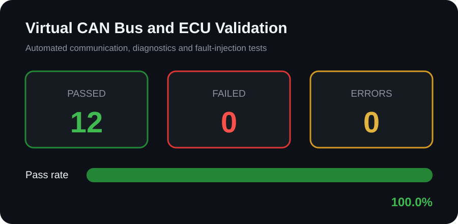

# CAN and ECU Validation Report

## Summary

- **Total tests:** 12
- **Passed:** 12
- **Failed:** 0
- **Errors:** 0
- **Pass rate:** 100.0%

## Detailed Results

| Test ID | Test name | Status | Details |
|---|---|---|---|
| CAN-001 | Create valid standard CAN message | PASS | Requirement verified |
| CAN-002 | Reject invalid CAN arbitration ID | PASS | Requirement verified |
| CAN-003 | Reject oversized classic CAN payload | PASS | Requirement verified |
| ECU-001 | Encode and transmit engine RPM | PASS | Requirement verified |
| ECU-002 | Encode and transmit vehicle speed | PASS | Requirement verified |
| ECU-003 | Encode and transmit coolant temperature | PASS | Requirement verified |
| ECU-004 | Reject out-of-range engine RPM | PASS | Requirement verified |
| DTC-001 | Set overtemperature diagnostic code | PASS | Requirement verified |
| DTC-002 | Clear diagnostic code after recovery | PASS | Requirement verified |
| FLT-001 | Detect injected CAN message drop | PASS | Requirement verified |
| FLT-002 | Detect injected CAN data corruption | PASS | Requirement verified |
| FLT-003 | Recover communication after fault clear | PASS | Requirement verified |

## Validation Scope

The automated suite validates standard CAN-message construction, arbitration-ID
and payload limits, ECU signal encoding, engine RPM, vehicle speed, coolant
temperature, diagnostic trouble-code behavior, message-drop injection, data
corruption and communication recovery.

## Important Note

This is a software-only CAN and ECU simulation. It demonstrates validation
methods without claiming experience with a physical CAN interface or vehicle.
